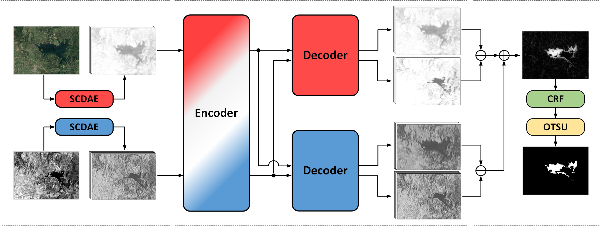

    <h2>
        Unsupervised heterogeneous remote sensing change detection via multi-scale Mamba attention and feature alignment
    </h2>

 

  

## Abstract
Heterogeneous change detection, which aims to identify land surface changes from multi-modal remote sensing images acquired at different times, has become a crucial yet challenging task due to the intrinsic disparities in imaging mechanisms across sensors. These disparities lead to inconsistent representations of the same geographical region, making feature alignment and robust change identification particularly difficult in the absence of annotated data. To address these challenges, we propose MambaHCD, a novel unsupervised framework that combines stacked convolutional denoising autoencoders (SCDAE) with an encoder-decoder network equipped with multi-scale Mamba attention (MSMA) modules. This architecture enables the extraction of noise-robust deep semantic features and the modeling of long-range spatial-spectral dependencies across modalities. To guide the network training without labeled data, we introduce a composite loss function consisting of self-mapping loss, cross-mapping loss, and a difference-map-based loss. This formulation jointly promotes intra- and cross-modal feature alignment while adaptively guiding the network to distinguish between changed and unchanged regions, thereby enhancing semantic discriminability and cross-domain robustness. The final change map is produced by computing the L2-norm difference between reconstructed features, followed by refinement using dense conditional random fields and adaptive thresholding. Extensive experiments on public benchmark datasets demonstrate that the proposed method significantly outperforms existing state-of-the-art approaches, validating its effectiveness for robust and unsupervised heterogeneous change detection.

## Note
The source code will be made publicly available after the paper is accepted.
